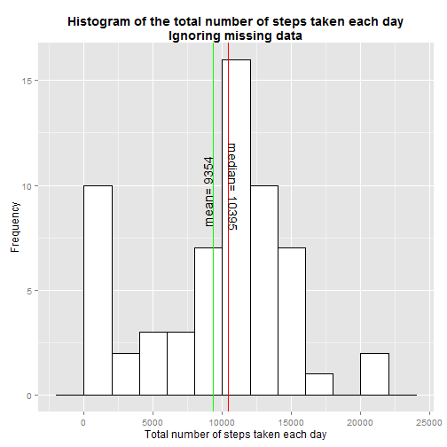
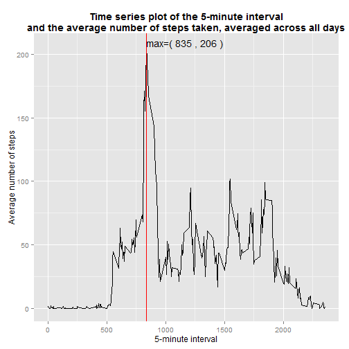
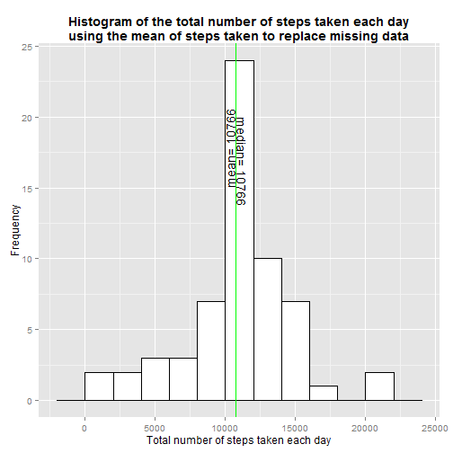
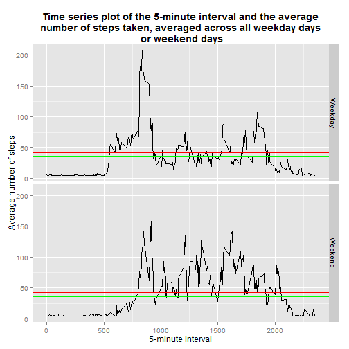

Reproducible Research: Peer Assessment 1
========================================================

This markdown report is produced in fullfillment of Assignment 1 of the coursera course: Reproducible research and includes the analysis of personal movement data.

## Part 1: Loading and preprocessing the data.

Here we load the plyr and ggplot2 libraries, followed by the data from the activity.csv file that is assumed to be in the same directory as this markdown file. The sums dataframe is then created to store the total steps taken per day in a dataframe.


```r
library(plyr)
library(ggplot2)
activity<-read.csv("activity.csv")
sums<-ddply(activity,c('date'),summarise,sum=sum(steps,na.rm=T))
```

## Part 2: Mean total number of steps taken per day. 

The histogram below indicates the number of steps taken per day highlighting the mean with the green line and median with the red. 


```r
p<-ggplot(sums,aes(x=sum)) + geom_histogram(binwidth=2000,colour='black',fill='white')
p<-p + ggtitle('Histogram of the total number of steps taken each day\nIgnoring missing data') + theme(plot.title=element_text(face='bold'))
p<- p + xlab('Total number of steps taken each day') + ylab('Frequency')
med_txt<-data.frame(x=median(sums$sum)+100,y=12, lab=paste('median=',median(sums$sum)))
mean_txt<-data.frame(x=mean(sums$sum)-100,y=8, lab=paste('mean=',round(mean(sums$sum))))
p<-p + geom_vline(xintercept=median(sums$sum), colour='red') 
p<-p + geom_vline(xintercept=mean(sums$sum), colour='green') 
p<-p + geom_text(data=med_txt,aes(label=lab,x=x,y=y),angle=270,hjust=0,vjust=0)
p<-p + geom_text(data=mean_txt,aes(label=lab,x=x,y=y),angle=90,hjust=0,vjust=0)
print(p)
```

 

The reported mean = 9354.2295 and the median = 10395.

## Average daily activity pattern

The time series plot below indicates the average number of steps taken per time interval across all days. 


```r
m_int<-ddply(activity,c('interval'),summarise,mean=mean(steps,na.rm=T))
p2<-ggplot(m_int,aes(interval,mean)) + geom_line()
p2<-p2 + ggtitle('Time series plot of the 5-minute interval\nand the average number of steps taken, averaged across all days') + theme(plot.title=element_text(face='bold'))
p2<-p2 + xlab('5-minute interval') + ylab('Average number of steps')
max_interval<-m_int[which.max(m_int[,2]),1]
max_mean<-m_int[which.max(m_int[,2]),2]
p2<-p2 + geom_vline(xintercept=max_interval, colour='red')
max_txt<-data.frame(x=max_interval,y=max_mean, lab=paste('max=(',max_interval,',',round(max_mean),')'))
p2<-p2 + geom_text(data=max_txt,aes(label=lab,x=x,y=y),hjust=0,vjust=0)                    
print(p2)
```

 

The plot shows that the interval=835 contains the maximum number of steps with an average of 206 for the interval.

## Inputing missing values

```r
incomplete<-nrow(activity[!complete.cases(activity),])
incomplete
```

```
## [1] 2304
```
There are 2304 rows with missing values (NA's) in the data set that may introduce bias into the above plots and calculations. On inspection of the histogram for the mean total number of steps each day the distribution looks nearly normal but is skewed by the a large number of NA's indicated by the bar to the left. As the distributon is nearly normal an assumption can be made that inputation of the missing number of steps to that of the mean number of steps would produce a normal distribution. the code below replaces all NA's in the steps column with the mean of all steps:


```r
activity[is.na(activity$steps),'steps']<-mean(activity$steps,na.rm=T)
head(activity)
```

```
##   steps       date interval
## 1 37.38 2012-10-01        0
## 2 37.38 2012-10-01        5
## 3 37.38 2012-10-01       10
## 4 37.38 2012-10-01       15
## 5 37.38 2012-10-01       20
## 6 37.38 2012-10-01       25
```
Now the ddply function is used to recreate the sums dataframe to, once again store the total steps taken per day, this time with the inputed data.


```r
sums<-ddply(activity,c('date'),summarise,sum=sum(steps))
```
The resulting histogram is shown below:

```r
p3<-ggplot(sums,aes(x=sum)) + geom_histogram(binwidth=2000,colour='black',fill='white')
p3<-p3 + ggtitle('Histogram of the total number of steps taken each day\nusing the mean of steps taken to replace missing data') + theme(plot.title=element_text(face='bold'))
p3<-p3+ xlab('Total number of steps taken each day') + ylab('Frequency')
med_txt<-data.frame(x=median(sums$sum)+100,y=20, lab=paste('median=',round(median(sums$sum))))
mean_txt<-data.frame(x=mean(sums$sum)-100,y=15, lab=paste('mean=',round(mean(sums$sum))))
p3<-p3 + geom_vline(xintercept=median(sums$sum), colour='red') 
p3<-p3 + geom_vline(xintercept=mean(sums$sum), colour='green') 
p3<-p3 + geom_text(data=med_txt,aes(label=lab,x=x,y=y),angle=270,hjust=0,vjust=0)
p3<-p3 + geom_text(data=mean_txt,aes(label=lab,x=x,y=y),angle=90,hjust=0,vjust=0)
print(p3)
```

 

The new reported mean = 1.0766 &times; 10<sup>4</sup> and the median = 1.0766 &times; 10<sup>4</sup>, show that the distribution is now normal, therfore the imputed data has removed the skew created by the previously unavailable values.

## Differences in activity patterns between weekdays and weekends

To differentiate activity between weekdays and weekends, we first create a column of type factor that labels each date as either a weekday or a weekend, the code for this is as follows:


```r
activity$date<-as.character(activity$date)
activity$date<-as.Date(activity$date)
activity$weekdays<-weekdays(activity$date)
activity$week<-as.factor(ifelse(activity$weekdays %in% c('Saturday','Sunday'),'Weekend','Weekday'))
activity$weekdays<-NULL
```
The panel plot is created using the week factor but the data is averaged over the interval column, therefore we build a data frame with the averaged interval values seperating out the weekend days from the week days:


```r
weekday<-activity[activity$week=='Weekday',]
mn_weekday<-ddply(weekday,c('interval'),summarise,mean=mean(steps))
mn_weekday$week<-as.factor('Weekday')
weekend<-activity[activity$week=='Weekend',]
mn_weekend<-ddply(weekend,c('interval'),summarise,mean=mean(steps))
mn_weekend$week<-as.factor('Weekend')
activity_mn<-rbind(mn_weekday,mn_weekend)
```

now we plot the interval(x) over the mean steps(y) and facet using the week column, the resulting time series plots representing the 5 minute interval against the average steps taken across all weekday days or weekend days is shown below. The red line indicates the average steps taken over a weekend and the green line indicates the average steps over the weekdays:


```r
p4<-ggplot(activity_mn,aes(interval,mean)) + geom_line()
p4<-p4 + facet_grid(week ~ .)
p4<-p4 + ggtitle('Time series plot of the 5-minute interval and the average\nnumber of steps taken, averaged across all weekday days\n or weekend days') + theme(plot.title=element_text(face='bold'))
p4<-p4 + xlab('5-minute interval')+ ylab('Average number of steps')
wend_mean<-mean(weekend$steps)
wday_mean<-mean(weekday$steps)
p4<-p4 + geom_hline(yintercept=wend_mean, colour='red')
p4<-p4 + geom_hline(yintercept=wday_mean, colour='green')
print(p4)
```

 

